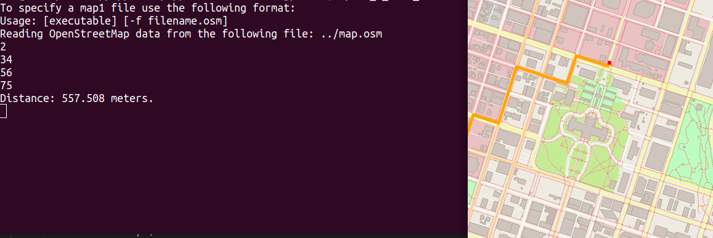
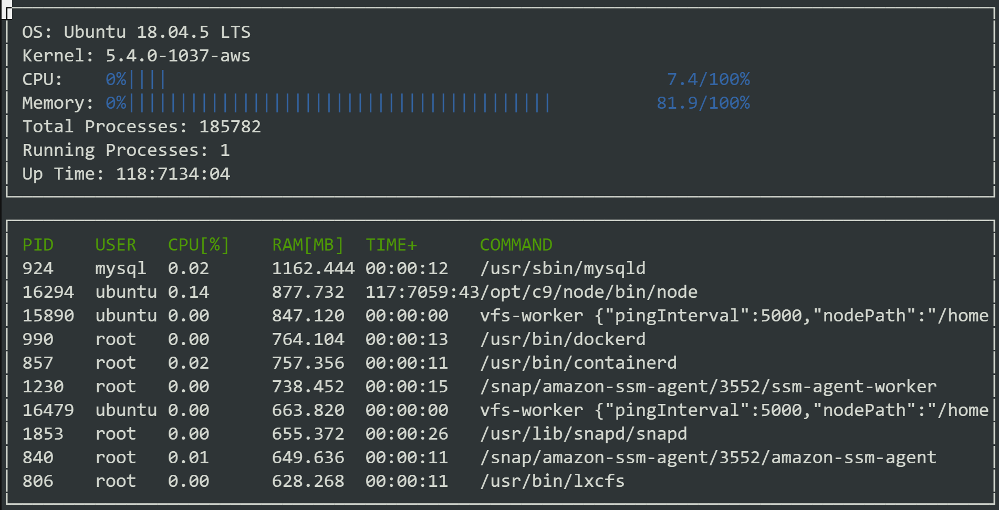
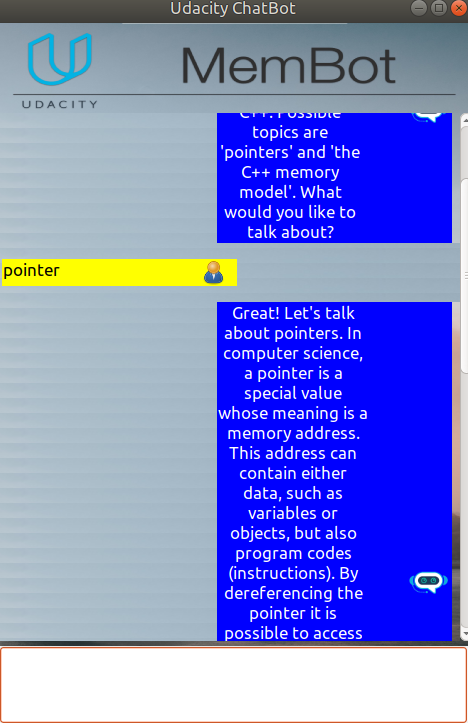

# Cpp-Nano-Udacity
## 1: C++ Foundations
Learn basic C++ syntax, functions, containers, and compiling and linking with multiple files. Use OpenStreetMap 
and the 2D visualization library IO2D to build a route planner that displays a path between two points on a map.
### Project: Build an OpenStreetMap
learn about OpenStreetMap data and look at IO2D map display code. extend the IO2D map display code to use A* to find a path between two points on the map. 

## 2: Object-Oriented Programming
Explore Object-Oriented Programming (OOP) in C++ with examples and exercises covering the essentials of OOP like abstraction and inheritance all the way through to advanced topics like polymorphism and templates. In the end, build a Linux system monitor application to demonstrate C++ OOP in action.
### Project: System Monitor 
write a Linux system monitor with similar functionality to the widely used htop application. having more familiarity with the Linux operating system and OOP.

## 3: Memory Management

### Project: Memory Management Chatbot

write the ChatBot which creates a dialogue where users can ask questions about some aspects of memory management in C++. After the knowledge base of the chatbot has been loaded from a text file, a knowledge graph representation is created in computer memory, where chatbot answers represent the graph nodes and user queries represent the graph edges. After a user query has been sent to the chatbot, the Levenshtein distance is used to identify the most probable answer.

## 4: Concurrency

### Project: Traffic Simulation

